

	
	<h1>Sleep Tracker</h1>

Welcome to the **Sleep Tracker** App!

This is a .NET and Angular project designed to demonstrate using Angular Material to build the UI components.

It allows users to visualise their sleep patterns. They can either manually add records or use a timer to record their sleep. They can also view, filter, sort, update and delete records. The web front end is delivered by Angular and built with Angular Material components. The API back end is delivered by .NET and provides the CRUD operations for managing sleep records in the database.

## Features

- **Angular**:
	- The web front end has been built with Angular v18.
- **Angular Material**:
	- The web components are provided by Angular Material.
- **Dialogs**:
	- Add, edit and delete forms are provided as dialogs as to not navigate away from the main page.
- **Form Validation**:
	- Form validation will ensure a form is valid before submission, and validation errors will be displayed on the associated control.
- **Snack Bars**:
	- Snack bars are used to display success, error, and warning messages after database actions.
- **.NET API**:
	- The front end interfaces with the back end through an API layer.
- **Versioned API**:
	- The SleepTracker.Api is a versioned API allowing for future feature expansion.
- **Entity Framework Core**:
	- Entity Framework Core is used as the ORM.
- **SQL Server**:
	- SQL Server is used as the data provider.
- **Responsive Web Design**: 
	- A user-friendly web interface designed to work on various devices.

## Technologies

- .NET
- Angular
- Angular Material
- HTML
- CSS
- TypeScript
- Entity Framework Core
- SQL Server

## Getting Started

**IMPORTANT NOTE**: 

The `InitialCreate` database migration has been created.

On start-up of the **API** application, any required database creation/migrations will be performed.

### Prerequisites

- .NET 8 SDK.
- Angular v18.
- Angular Material v18.
- A code editor like Visual Studio or Visual Studio Code.
- SQL Server.
- SQL Server Management Studio (optional).
- Node.js.
- NPM.

### Installation

1. Clone the repository:
	- `git clone https://github.com/chrisjamiecarter/sleep-tracker.git`

2. Navigate to the API project directory:
	- `cd src\SleepTracker.Api`
	
3. Configure the application:
	- Update the connection string in `appsettings.json` if required.
	
4. Build the application using the .NET CLI:
	- `dotnet build`

5. Navigate to the Web project directory:
	- `cd src\SleepTracker.web`

6. Install dependencies:
	- `npm install`

### Running the Application

1. You can run both applications from Visual Studio, using the **Multiple Startup Projects** option and selecting the *.Api and *.web projects.

OR

1. Run the API application using the .NET CLI in the API project directory:
	- `cd src\SleepTracker.Api`
	- `dotnet run`

2. Start the development server in the Web project directory:
	- `cd src\SleepTracker.web`
	- `npm start`

## Usage

Once the Web application is running:

- View a list of Sleep Records.
- Filter the list of Sleep Records.
- Change the pagination options.
- Add a new Sleep Record manually.
- Add a new Sleep Record via the Timer page.
- Edit a Sleep Record.
- Delete a Sleep Record.
- If an Error message is returned, check API is running, check port running on.

### Sleep Tracker

### Sleep Record Filtering

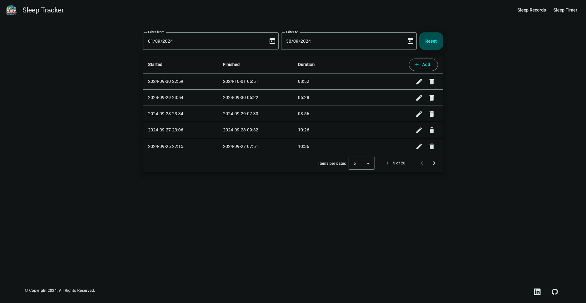

### Sleep Record Pagination

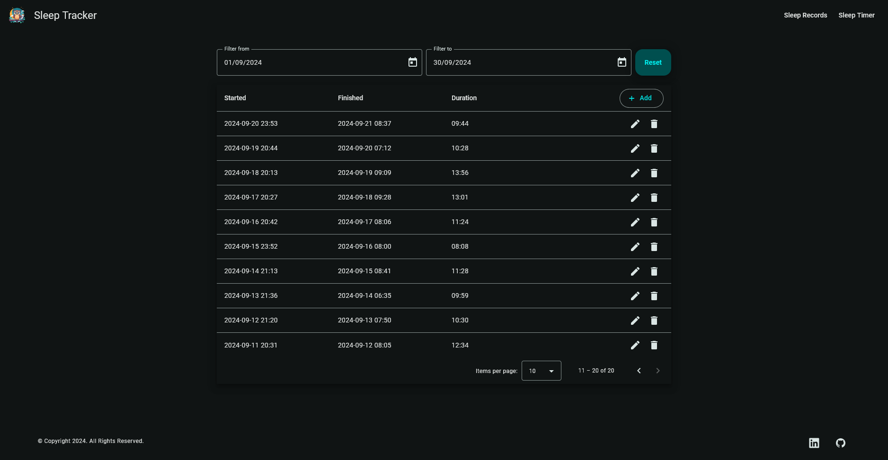

### Sleep Record Sorting

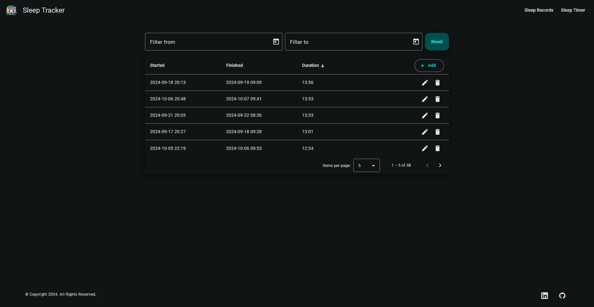

### Add Sleep Record Dialog

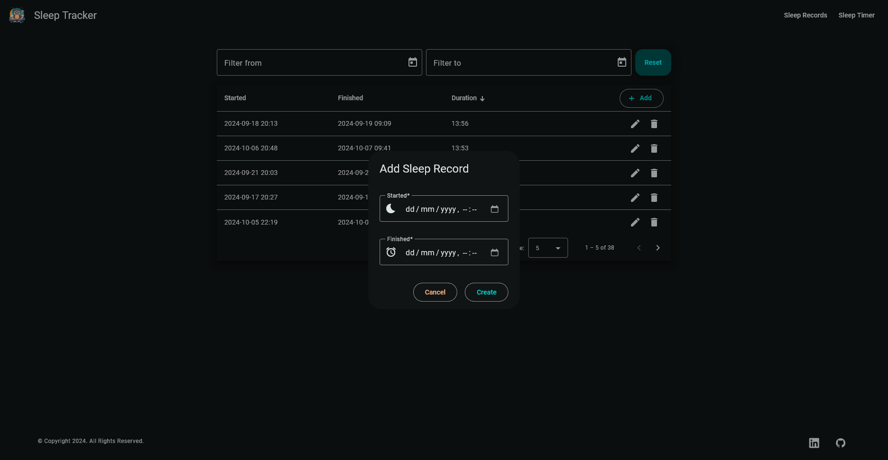

### Sleep Record Required Validation

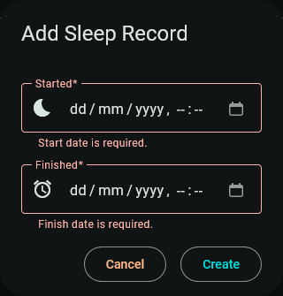

### Sleep Record Finished Date Validation

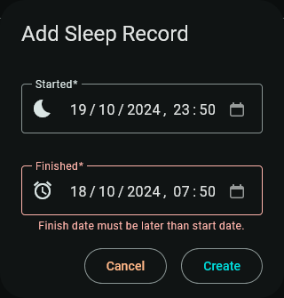

### Success Snack Bar

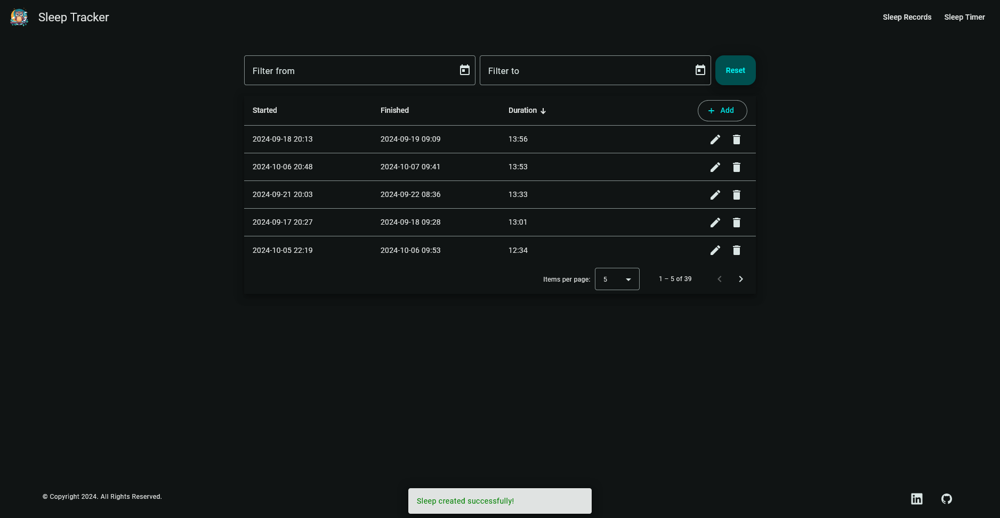

### Error Snack Bar

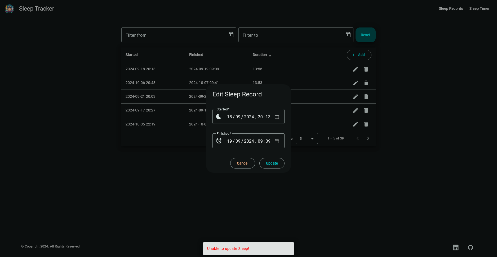

### Progress Spinner

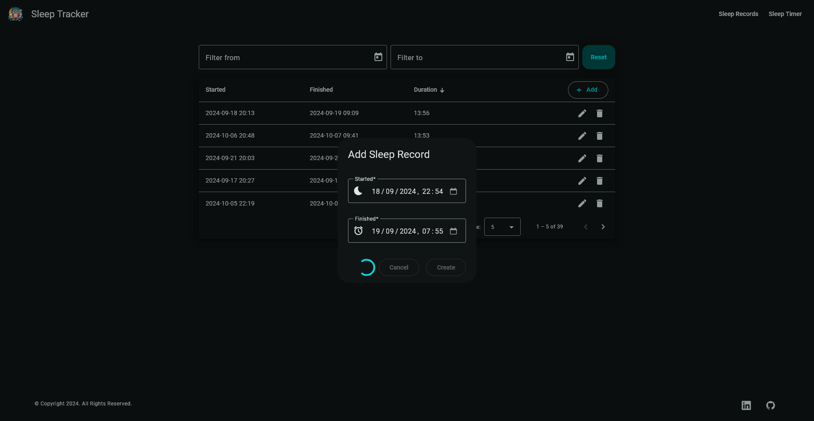

### Edit Sleep Record

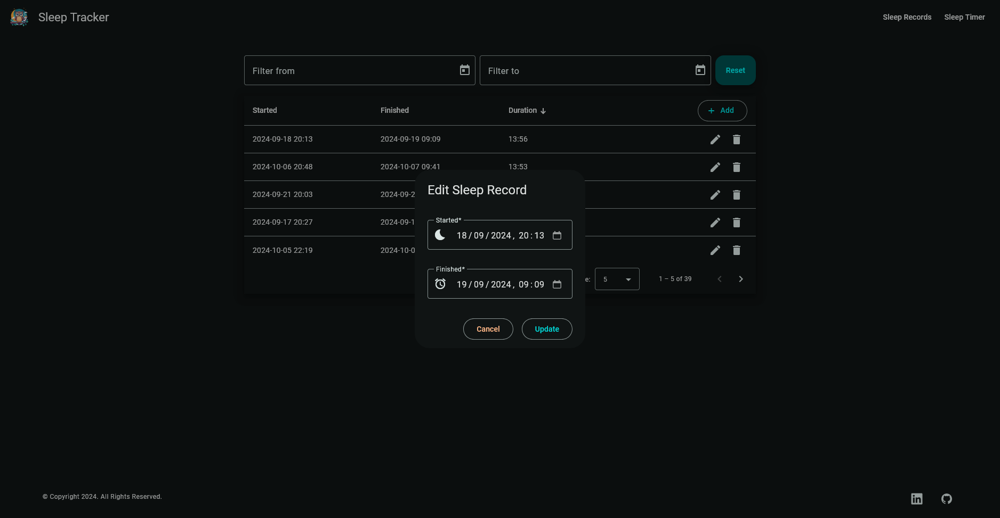

### Delete Sleep Record

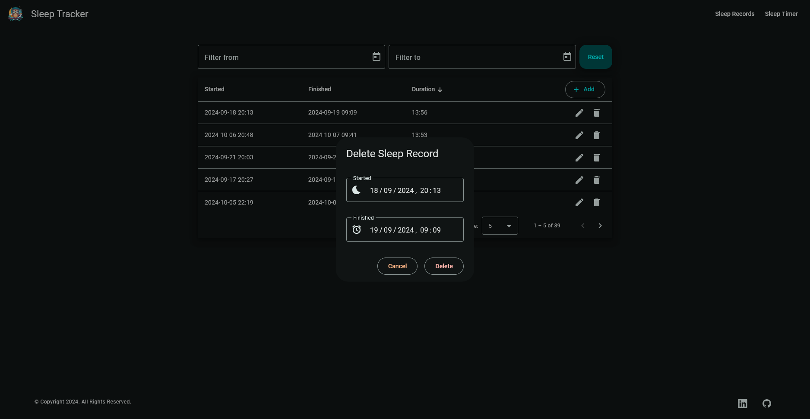

### Sleep Timer

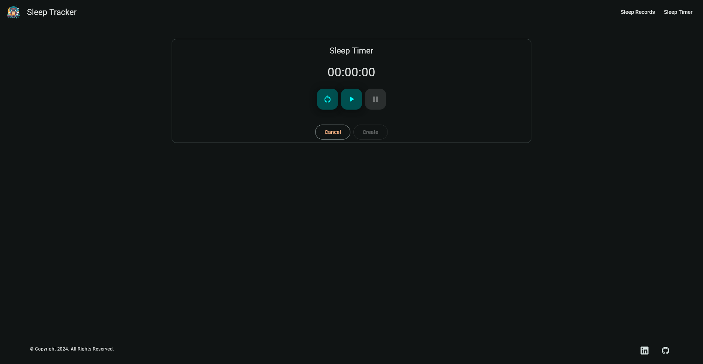

## How It Works

- **Web Project**: This project was generated with [Angular CLI](https://github.com/angular/angular-cli) version 18.2.6.
- **Web Design**: This project uses components provided by [Angular Material](https://material.angular.io/) version 18.2.6.
- **API Project**: HTTP requests are used to interface the web and api projects.
- **Create**: A SleepRecord can be created by supplying the Started and Finished dates.
- **Return**: A collection of SleepRecords can be returned with ID, Started, Finished and Duration values.
- **Update**: A SleepRecord can be updated by supplying the ID, and updated Started and Finished dates. The updated SleepRecord is returned.
- **Delete**: A SleepRecord can be deleted by supplying the ID.
- **Data Storage**: A new SQL Server database is created and the required schema is set up at run-time, or an existing database is used if previously created.
- **Data Access**: Interaction with the database is via Entity Framework Core.
- **Mock Data**: This project will automatically insert four weeks of faked records into a fresh database (i.e. 0 sleep records).

## Database

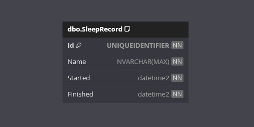

## Version

This document applies to the SleepTracker v1.0.0 release version.

## Contributing

Contributions are welcome! Please fork the repository and create a pull request with your changes. For major changes, please open an issue first to discuss what you would like to change.

## License

This project is licensed under the MIT License. See the [LICENSE](./LICENSE) file for details.

## Contact

For any questions or feedback, please open an issue.

---
***Happy Sleep Tracking!***
